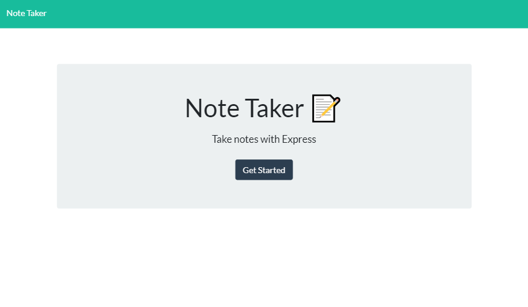

# note-taker

### Description

Note taker where the user can write, save, and delete notes.   This app uses an express backend and save and retrieve note data from a JSON file. :date:

*Key words* : 
*Servers*, *Express.js*, *Routing* , *API routes* 

### User Story

AS A user, I want to be able to write and save notes  
I WANT to be able to delete notes I've written before  
SO THAT I can organize my thoughts and keep track of tasks I need to complete 

### Technologies used 
Express.Js  
Postman

  

